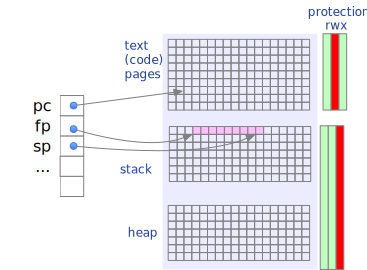
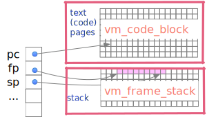

# Memory structures of the tiny virtual machine

The tiny virtual machine (tvm) is a _pedagogical_ virtual machine, 
designed for an advanced undergraduate or beginning graduate level 
compiler construction course.  It is designed to be understandable, 
and to illustrate techniques used in interpreters as well as runtime 
structures in compiled "native" code.  

Like native code organization, and unlike typical interpreter cores 
like the Java virtual machine or the Python virtual machine, memory 
in tvm is a homogenous array of memory words divided into code, 
stack, and heap regions.  Activation records in the stack are 
managed explicitly with a frame pointer and stack pointer, and 
contain both code addresses (e.g., return addresses for called 
methods) and object references.  This is intended to make native 
runtime organization transparent to students, and to make code 
generation tactics for tvm reasonably close to code generation for a 
hardware CPU (albeit the tvm is stack-oriented rather than register 
oriented). 

Like some interpreters and unlike most native code, tvm uses
_threaded code_:  tvm instructions are represented by pointers to native
code functions (written in C) that implement those instructions. 
This is a useful technique for building interpreters, but the main
reason for using threaded code is to keep the interpreter core very
small and thereby easier to read and understand.

## A homogenous memory model

tvm memory, including both program code and the activation 
record stack, is organized as an array of `vm_Word`, which like 
words of memory in a hardware computer are untyped.  A `vm_Word` can 
be anything that can be represented in the memory of the virtual 
machine, including instructions, addresses of data objects, and 
addresses of instructions.  Being untyped, a `vm_Word` is 
represented in C code as an untagged union in `vm_core.h`:

```c
typedef union u_Word *vm_addr;

/* Memory is untyped.  All these things can be stored in memory words. */
typedef union u_Word {
    vm_Instr  instr;         // A virtual machine instruction
    // Some instructions are followed immediately by an operand
    // which may be ...
    vm_Intval intval;        // Only for method slot indexes; these are not Int objects
    vm_Native native;        // A native method
    // The following things appear in the activation record stack
    obj_ref obj;            // Reference (pointer) to an object
    class_ref clazz;        // A class to be instantiated
    vm_addr code_addr;      // Saved program counter
    vm_addr frame_addr;    // Saved stack or frame pointer;
} vm_Word;
```

On modern hardware, these undifferentiated memory cells are divided 
into _pages_ managed by the virtual memory system, and the pages are 
divided into regions called _segments_.  While the memory cells in 
the pages of a particular segment may contain many different kinds 
of value, pages or whole segments are usually associated with 
_permissions_ that are appropriate for the kinds of data stored in 
those segments.  For example, in a Unix system (including Linux), 
the _code segment_, which holds the machine code instructions of a 
process, may typically be read and executed but not written by the user 
process, 
while the _data segment_ may be read and written but not executed.  



tvm does not have virtual memory or segments, but it does keep two 
arrays of memory cells corresponding roughly to the code segment and 
data segment of a Unix process. 



In `vm_state.c`, memory space for program instructions is created as 
an array of `vm_Word`:

```c
vm_Word vm_code_block[CODE_CAPACITY];
```

The program counter (which would be a special register in a hardware 
CPU) is simply a pointer that initially references the first word of 
`vm_code_block`:

```c
vm_addr vm_pc =   &vm_code_block[0];
```

Note that we use actually addresses, not indexes. We will see below 
that this is important for dealing with code of built-in methods, 
which are in exactly the same form as program code but stored 
outside of `vm_code_block`.

The structure corresponding to the data segment of a Unix process is 
likewise an array of `vm_Word`, also in `vm_state.c`.  We use 
it primarily to store _activation records_ of functions or methods, 
and keep two pointers, a _frame pointer_ and _stack pointer_ to 
track activation records in use: 

```c
vm_Word vm_frame_stack[FRAME_CAPACITY];

vm_Word *vm_fp = vm_frame_stack;    // Frame pointer, points to "this" object
vm_Word *vm_sp = vm_frame_stack;    // Stack pointer, points to top item
```

### Things that didn't fit

Ideally _every_ word of memory accessed by tvm would lie in one of 
these segments.  For practical reasons I left two things out: 
Heap-allocated objects and built-in methods.  

Heap-allocated objects could be placed in the data segment.  A 
typical tactic is for the activation record stack to grow downward 
from the top of the data segment while the heap grows upward from 
the bottom.  Placing the heap in the simulated data segment (or in its 
own segment) could be important for _garbage collection_, but at 
present there is no garbage collector or other scheme for recycling 
heap-allocated objects in tvm. (This may change!)
Instead, we use the Unix process heap,
and let garbage accumulate.  Fixing this is a project for another day. 

Built-in methods (for example, the method that adds two Int objects) 
typically need to make calls on _native_ functions.  To do this, 
they need the addresses of those functions, which are written in C.  
This is easy to do in C code, but difficult to do in the interpreter,
so built-in functions (whether or not they call native functions) 
are represented by small arrays of `vm_word` within the C code of 
`builtins.c`.  For example, here is the built-in `print` 
method of class `String`: 

```c
vm_Word method_String_print[] = {
        {.instr = vm_op_enter},
        {.instr = vm_op_call_native},
        {.native = native_String_print },
        {.instr = vm_op_return},
        {.intval = 0 }
};
```
This is identical to the binary code sequence as it would appear in 
`vm_code_block`, but the C compiler can resolve the correct function 
pointer address to use for `native_String_print` (a C function), 
whereas the process loader would have difficulty resolving it.  

## Activation record layout
