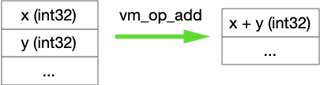
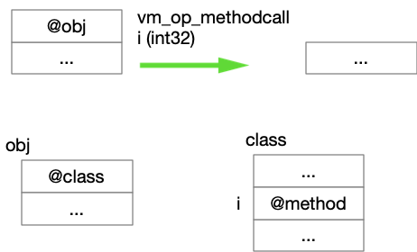
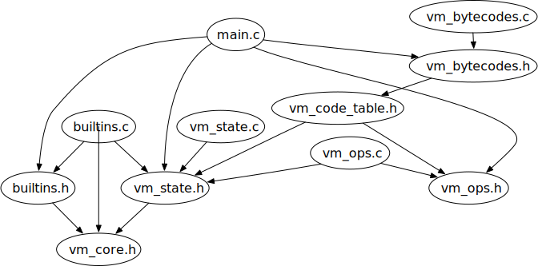

# Notes on Tiny VM source files

# `vm_core`

## VM core structures.

Code blocks are arrays of "words", each of which may be an

- *instruction*: pointer to a C function that executes that instruction
- *native C integer*: used to index method tables
- *native method*:  pointer to a C function that executes

Native method pointers and native C integers are "inline" data that appear only
immediately after instructions that references them. A native C integer appears
after a vm_call_method instruction. A native method pointer appears after
a `vm_call_native` instruction, in a "trampoline" that converts a regular method
call into a native method call.

## Calling conventions:

An interpreted method is called by creating a new vm stack frame, setting the
program counter, etc. A native method is called through a C function pointer.
Since a native method in a superclass can be overridden by an interpreted method
in another, code for a method call must work for both.

We considered three alternatives:

(a) Keep a tag in each method entry, indicating whether it is a native method or
an interpreted method, and use the appropriate calling convention.

(b) Use the native calling convention, with native code that invokes the the
interpreter when the method is interpreted.

(c) Use the interpreted calling convention, with a facility for interpreted code
to call native code.

Options (b) and (c) are called "trampolines". (b) looked attractive but tricky.
We opted for (c):  We will always use the interpreted method calling convention,
but the interpreted method may be a short trampoline sequence to invoke the
native method through a C function pointer. Moreover, since we would like to
reuse these native methods when we create fully compiled code, without revising
all the methods to use native calling conventions, the trampoline sequence will
go through shims that take care of arguments and results.

## Class structures:

A class structure contains a header and a method table. The header contains the
class name (just for debugging) and a pointer to its superclass (for "
isinstance" or "typecase" tests). The method table, called a "vtable" after the
C++ structure in which method pointers are called "virtual functions", is an
array of pointers to code blocks. When the method is native (compiled C code),
the code block will be a short "trampoline" sequence that calls the native
method using a `vm_call_native` instruction.

## Object structures:

The header of an object contains a pointer to its class, and may hold other
bookkeeping information. Object fields follow the header. Most object fields are
pointers to objects, but built-in classes (Int, String, etc) may have fields
that are native C data structures rather than objects. for example, an Int
object has a field that is a native C int.

# `vm_ops`

Core operations of the virtual machine, distinct from the methods of built-in
classes in `builtins.c`

`vm_ops.c` references `vm_state.h`

## Stack machine semantics notation

A stack machine instruction may be followed by an immediate operand. It will pop
0 to m operands off the evaluation stack and push 0 to n operands onto the
evaluation stack. We will write signature of such an instruction as follows:

*op-name* : [*op1*: type,  *op2*: type ... ] -> [*res1*: type, ... ]

for an operation that does not have an immediate operand, or

*op-name* *immediate*: type : [ *op1* *op2* ... ] -> [ *res1*: type, ... ]

*fixme*:  Where can I put types without cluttering the notation?

for an operation that does have an immediate operand. For example,
the `vm_op_add` instruction pops two native integers and pushes their sum. We
summarize it as

`vm_op_add` : [ *i1*, *i2*] -> [ *i1+i2* ]

The `push_constant` instruction is summarized as

`push_constant`  *i*: [] -> [ *i* ]

Operations:

- `vm_op_add`  (add top two eval stack elements)  
  
- `vm_op_const` (next word is constant to be pushed to eval stack)  
  
- `vm_op_halt` (stop the virtual machine)
- `vm_op_methodcall` (next word is index of method to call; object on which to
  call it is on top of eval stack)  
  `vm_op_methodcall` *i* : [*arg* ... *obj* ] -> [ ]
  

Looks up method *i* of the class of *obj* and calls it.

*FIXME:  Does this function move arguments to the stack frame? Do we pass
arguments on evaluation stack or the activation stack?*

# `vm_state`

The state of the virtual machine, as a shared structure (global variables).

Each operation of the virtual machine may inspect and modify this state. Common
operations such obtaining the next instruction word and advancing the
instruction pointer are provided by vm_state.

References `vm_core.h`

Declares externally visible objects:

- `vm_run_state` is `VM_RUNNING` or `VM_HALTED`
- `vm_frame_stack` is an array of `vm_Word`
- `vm_sp` (the stack pointer) is a `vm_addr`
- `vm_fp` (the frame pointer) is a `vm_addr`

Declares externally visible functions:

- `vm_frame_push_word(vm_Word val)` push single word on frame
- `vm_frame_pop_word() -> vm_word` pop single word from frame
- `vm_call`  what the calling procedure does to make a call Needs revision for
  arguments on the stack.
- `vm_enter` What the called procedure does on entry, including allocation of
  frame space.
- `vm_return` What the called procedure does to resume execution in the calling
  procedure.

These need revision to allow arguments on the stack.

- `vm_run`  Place the virtual machine into running state and run until it is
  halted or crashes.

# Calling conventions

The tiny vm is a stack machine, simpler but in roughly the same style as the
Python virtual machine or Java virtual machine and many others. We would like
procedure call and return to fit with the stack machine style, so we want a
method call to consume (pop) its arguments and leave its result on the stack.

Here's how Java does it:

> The nargs argument values and objectref are popped from 
> the operand stack. A new frame is created on the Java Virtual Machine stack
> for the method being invoked. The objectref and the argument values are 
> consecutively made the values of local variables of the new frame, with 
> objectref in local variable 0, arg1 in local variable 1 (or, if arg1 is of 
> type long or double, in local variables 1 and 2), and so on. Any argument 
> value that is of a floating-point type undergoes value set conversion (§2.8.3)
> prior to being stored in a local variable. The new frame is then made current,
> and the Java Virtual Machine pc is set to the opcode of the first instruction 
> of the method to be invoked. Execution continues with the first instruction of
> the method. 

The CPython method call conventions (two of them!) are much more involved
and involve creating special purpose objects in which arguments are passed.  

# Tables

The tiny virtual machine depends on several tables, some at load time (to
translate the external format into the internal form) and some at run time (to
execute instructions). Some tables entirely static, while others are built while
a program is loaded.

## `vm_ops`

Maps the integer operation codes of the virtual machine to C function pointers
for their implementation.

This static table is available through `vm_ops.h`
and is implemented in `vm_ops.c`.

## `native_methods`

Similar to `vm_ops`, but in this case the C functions act as implementations of
methods in the object model. They "know about" objects, classes, fields, etc.
Since each native method must be compiled by the C compiler, this is also a
static table.

## `constants`

A table of object constants, so that we can create them once and reuse them.
These constants are literals (e.g., there may be an Int object wrapping the
machine integer 42, created in response to the literal "42"), so the table is
indexed by the string literal from which it was triggered. In the case of string
constants, quotation marks are not part of the table index.

This table is constructed and used at load time. It needn't be fast since the
number of literals in a program is small, and since it is not accessed during vm
program execution.

# Trampolines

The term "trampoline" has several senses in programming, and even within
compiler construction. All of them have to do with making some kind of jump (
usually a procedure call) that sets up another kind of jump. One of it's
meanings is a procedure call using one set of calling conventions (e.g., in an
interpreter) which then immediate makes a call with a different set of calling
conventions (e.g., to native code). You might also call that a
*shim* or a *proxy*. We use this kind of trampolining to call native methods in
the tiny vm.

The method call instruction in the tiny vm calls an interpreted method. This is
the only kind of procedure designed to be available to the high-level
programmer. However, at least some of the built-in methods must be implemented
in native code (code for the host processor, rather than code for the vm). There
is a
`call_native` instruction for this purpose. The built-in methods are simple
trampolines that just invoke invoke corresponding native code through function
pointers.

# Dependency structures

## Includes (.h files)

